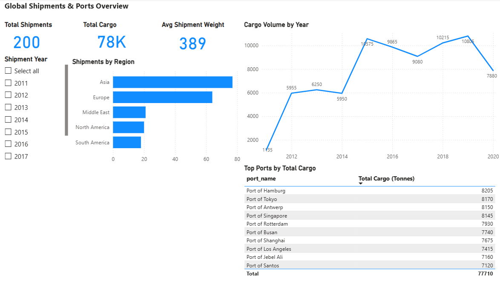
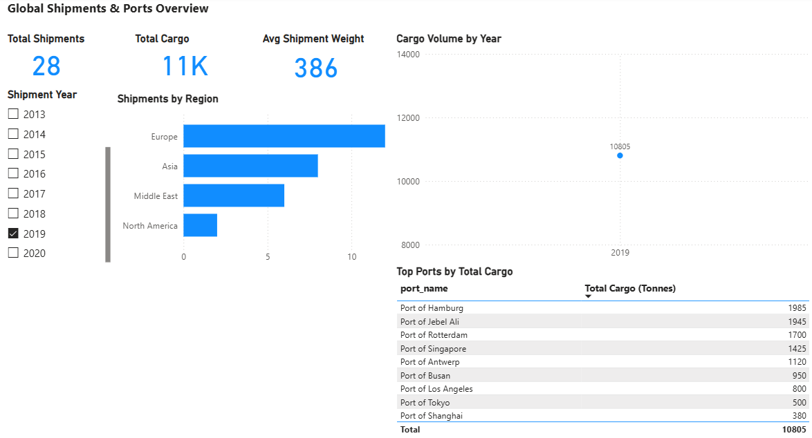

## 📊 Power BI Dashboard

A Power BI dashboard was built on top of the SQL Server dataset to visualise shipment trends and port performance.

### Key Insights
- Overall shipment volume and average cargo weight
- Shipment distribution across global regions
- Year-over-year cargo volume trends
- Top ports ranked by total cargo handled
- Interactive filtering by shipment year

### Dashboard Preview

**Overview**

**Filtered View (2019)**

> The dashboard connects directly to a SQL Server database and demonstrates an end-to-end analytics workflow from data ingestion to visual storytelling.
